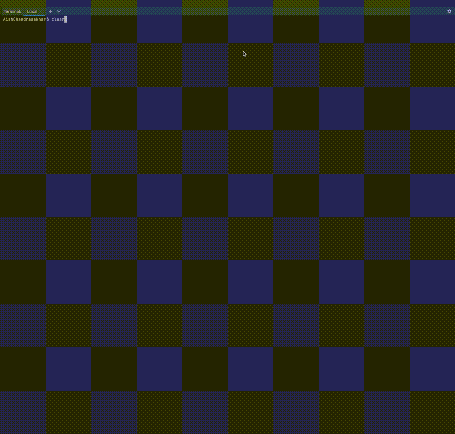

# hello-tools-agent

A tiny, inspectable **agent system** that demonstrates the core agent loop:

> **decide → act (tool) → observe → answer**

This project is intentionally simple and rule-based so the mechanics of
tool-using agents are easy to understand and inspect.

---

## What this agent can do

- Decide whether a task requires a **calculator** or a **web search**
- Call the selected tool with **structured, validated arguments** (Pydantic)
- Observe the tool result and turn it into a user-facing answer
- Print each step clearly in the terminal



---

## Architecture (important)

The agent is split into **three clear responsibilities**:


- **The planner** decides *what to do next* (which tool to call, or when to stop)
- **The controller** executes that decision and manages the loop
- **Tools** perform isolated actions and return structured results

This separation mirrors how modern agent frameworks are designed
(LangChain, LangGraph, AutoGPT, CrewAI).

---

## Agent loop

At a high level, the agent follows this loop:


In this Day-1 implementation:
- The planner uses **simple rules** (no LLM required)
- The agent intentionally stops after one tool call for clarity

Later projects replace the planner with LLM-based reasoning and multi-step loops.

---

## Tools

- **calculator(expr)**  
  Safe, math-only evaluation using Python’s `math` module

- **web_search(query, k)**  
  Web search using the maintained [`ddgs`](https://pypi.org/project/ddgs/) library  
  (DuckDuckGo wrapper), with graceful fallbacks if needed

Each tool:
- Does one thing
- Has no memory
- Never decides when it should be called

---

## Quickstart

```bash
python -m venv .venv && source .venv/bin/activate
pip install -r requirements.txt

python agent.py chat "sqrt(144) + 5"
python agent.py chat "Who is the CEO of Apple?"
