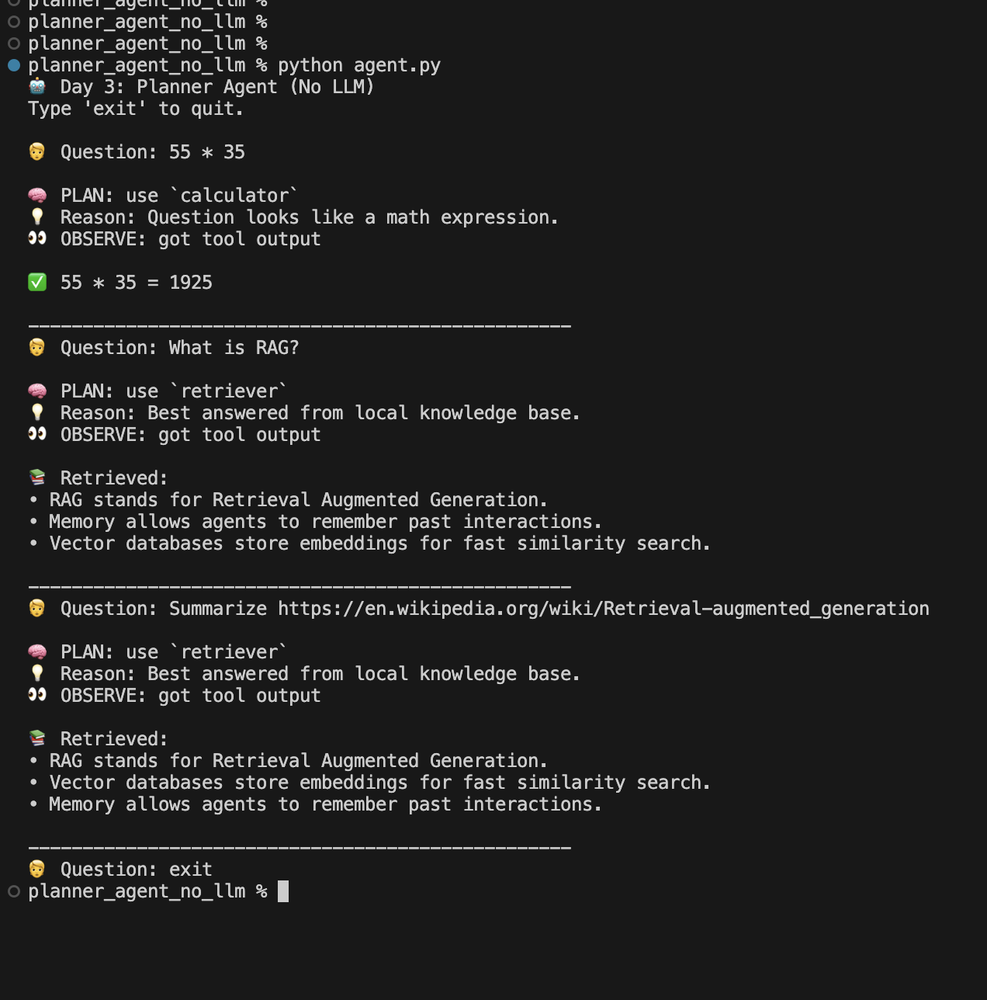

# 🤖 Day 3 — Planner Agent (No LLM)

A deterministic **tool-routing AI agent** that demonstrates how agents decide *which tool to use* before acting.

Instead of hiding decisions inside an LLM prompt, this project makes the planner explicit and observable:

> **Plan → Act → Observe**  
> ✅ Rule-based planning (no LLM)  
> ✅ Clear tool selection + reasoning  
> ✅ Two demos: terminal + browser UI

---

## 🎬 Demos

### 🖥️ Terminal Demo (agent.py)

This demo shows the agent’s decision process in the terminal:
- The planner chooses a tool (`calculator`, `retriever`, or `web`)
- It prints *why* it chose that tool
- Then it executes the tool and prints the result



---

### 🌐 Browser Demo (app.py)

This demo wraps the exact same agent logic in a Gradio UI.
It’s useful for showcasing the agent to non-technical users and making the behavior easy to test interactively.


---

## 🧠 What This Project Teaches

Giving an agent tools is easy.

The real intelligence is in **tool selection**:
- When should the agent calculate?
- When should it retrieve from local docs?
- When should it consult the web?

This project implements that decision-making using **explicit rules**, so the agent is:
- Predictable
- Debuggable
- Safe (no hallucinated tool calls)

This is the “bridge step” before switching to LLM-based planners in Day 4.

---

## 🧩 How It Works (High Level)

User Question
↓
Planner decides which tool to use (and why)
↓
Tool runs (calculator / retriever / web)
↓
Agent prints tool output + trace


---

## 🗂️ What Each File Does

### `agent.py` — Controller (Execution Engine)
Runs the agent loop:
- calls the planner
- routes the request to the chosen tool
- prints a readable trace of the decision + result

It does **not** decide which tool to use — it only executes the plan.

---

### `planner.py` — The Planner (Decision Policy)
Implements deterministic rules for tool routing.

Given a question, it returns:
- **selected tool**
- **reason** for selection (human-readable)

This makes the agent’s decision-making visible and testable.

---

### `tools/calculator.py` — Math Tool
Validates arithmetic input and evaluates it safely (numbers + operators only).

---

### `tools/retriever.py` — Local Retrieval Tool (RAG without LLM)
Builds a simple retrieval system that:
- loads text from `sample_docs/`
- embeds chunks using SentenceTransformers
- searches them with FAISS similarity search
- returns top-k relevant chunks

---

### `tools/web.py` — Web Fetch Tool
Fetches a web page and extracts visible text for quick lookups.
(Used to demonstrate routing for “web-needed” queries.)

---

### `app.py` — Gradio UI Demo
Browser interface that displays:
- chosen tool
- planner reason
- tool output

---

## 🛠️ Tools & Libraries Used

- **Python**
- **sentence-transformers** — embeddings
- **FAISS** — vector similarity search
- **requests + BeautifulSoup** — fetch + clean webpage text
- **Gradio** — interactive browser demo

---

## ▶️ Running Locally

### 1️⃣ Install Dependencies

```bash
pip install sentence-transformers faiss-cpu requests beautifulsoup4 gradio


2️⃣ Run Terminal Demo (agent.py)
python agent.py
Try:
45 * 19
What is RAG?
Summarize https://en.wikipedia.org/wiki/Retrieval-augmented_generation


3️⃣ Run Browser Demo (app.py)
python app.py
