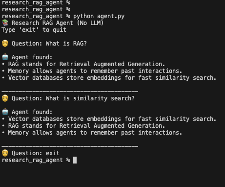
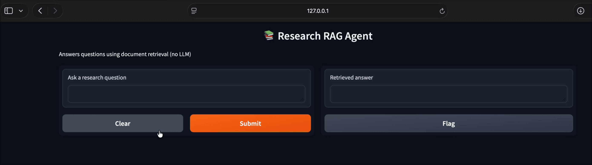

# 📚 Research RAG Agent (No LLM, No Hallucinations)

A simple, transparent **Research AI Agent** that answers questions **only by retrieving relevant information from documents**.

This project demonstrates the core idea behind **Retrieval Augmented Generation (RAG)** — without using any large language models.

> ❌ No OpenAI  
> ❌ No text generation  
> ✅ Just retrieval, similarity search, and math  

---

## 🧠 What This Agent Does

The agent follows one strict rule:

> **Never guess. Always look things up.**

It can:
- Ingest text files (and URLs)
- Break documents into small chunks
- Convert text into embeddings
- Store them in a vector database
- Answer questions by retrieving the most relevant chunks

This makes the system:
- Deterministic
- Transparent
- Easy to debug
- Safe for research workflows

---

## 🧩 How It Works (High Level)

User Question
↓
Convert question to embedding
↓
Search vector database
↓
Return closest matching text chunks


Think of it as **Ctrl + F for meaning**, not keywords.

---

## 🎬 Demos

### 🖥️ Demo 1 — Terminal (CLI)

A command-line interface where you can ask questions and see the agent retrieve relevant information from its documents.

**What it shows:**
- End-to-end retrieval flow
- No hallucinated answers
- Clear, readable output

📸  



---

### 🌐 Demo 2 — Browser (Gradio App)

A simple web interface built with Gradio that lets you interact with the agent in the browser.

**What it shows:**
- How the same agent logic can be productized
- User-friendly interface
- Real-time retrieval results

📸  

---

## 📁 Project Structure
research_rag_agent/
│
├── ingest.py # Loads and chunks documents
├── embed.py # Converts text into embeddings
├── search.py # Vector search using FAISS
├── agent.py # Core agent logic
├── app.py # Gradio web app
├── sample_docs/
│ └── ai_notes.txt
├── terminal_demo.gif
├── browser_demo.gif
└── README.md


---

## 🛠️ Tools & Libraries Used

- **Python**
- **sentence-transformers** — semantic embeddings
- **FAISS** — fast vector similarity search
- **Gradio** — browser-based demo UI

---

## ▶️ How to Run Locally

### 1️⃣ Install Dependencies

```bash
pip install sentence-transformers faiss-cpu gradio
2️⃣ Run the Terminal Agent
python agent.py
Ask questions directly in the terminal.
3️⃣ Run the Browser Demo
python app.py
Open the local URL to interact with the agent in your browser.